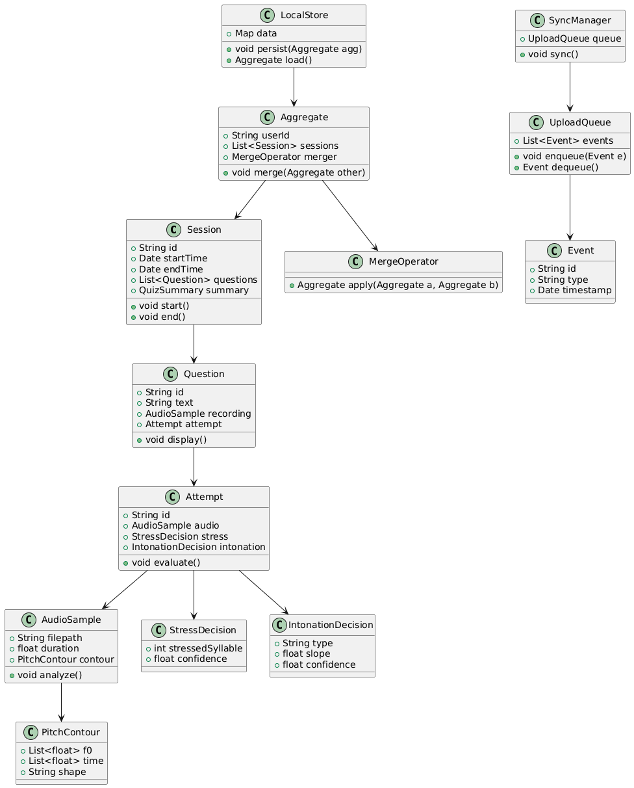

= Class Diagram Design for Quiz Session, Persistence, and Prosody Evaluation
:doctype: article
:toc: left
:icons: font
:source-highlighter: rouge

== 1. Introduction

This brief designs a class-level architecture that integrates concepts from previous artifacts — **statechart (session logic)**, **Petri net (resource concurrency)**, and **algebraic merge operators** (for offline-safe data).  
It proposes a unified class model that organizes quiz sessions, persistence, and prosody evaluation in a modular, testable structure.

<<<
== 2. Class Diagram Overview

<<<
== 3. Diagram explanation

Each box is a class: the top line is the class name, the middle lists key fields, and the bottom lists important methods. Arrows show ownership or usage (for example, a `Session` contains `Question` objects, and a `Question` references an `Attempt`).

The central vertical flow models the session lifecycle: a `Session` holds `Question`s; answering creates an `Attempt` that contains an `AudioSample` and evaluation results (`StressDecision`, `IntonationDecision`). `AudioSample` links to `PitchContour` used for intonation analysis.

The top-center `Aggregate` is the offline, mergeable summary of a user’s history. `LocalStore` persists aggregates locally and `MergeOperator` defines how two aggregates combine deterministically during sync. Treat `Aggregate.merge()` as the place to enforce associativity and deduplication.

The right column models sync and export: `SyncManager` owns an `UploadQueue` of `Event`s that are uploaded in the background. This maps to the Petri-net resource region and highlights the need for bounded queues and upload backoff.

Typical runtime sequence: create a `Session`; show a `Question`; produce an `Attempt`; run `Attempt.evaluate()` which fills `StressDecision`/`IntonationDecision`; fold the result into an `Aggregate` and call `LocalStore.persist()`; enqueue an `Event` for the `UploadQueue`; `SyncManager` later uploads and uses `MergeOperator` to reconcile remote state.

Implementation notes: prefer immutable `Aggregate` objects or copy-on-write updates; use a single background uploader (single-writer) to drain `UploadQueue`; generate stable `Event.id` values so merges can deduplicate safely; and enforce bounds + exponential backoff on the queue to avoid unbounded growth under poor network conditions.

== 4. Dart Type Sketches

The sample Dart types below are minimal sketches to communicate the shape of the core domain objects and the API surface. They are not full implementations — they show the fields and primary methods developers should expect. Use these as a starting point for concrete data classes, interfaces, and unit tests.

[source, dart]
----
class Session {
  String id;
  DateTime startTime;
  DateTime endTime;
  List<Question> questions;
  QuizSummary summary;

  void start() {}
  void end() {}
}

class Question {
  String id;
  String text;
  AudioSample? recording;
  Attempt? attempt;

  void display() {}
}

class Attempt {
  String id;
  AudioSample audio;
  StressDecision? stress;
  IntonationDecision? intonation;

  void evaluate() {}
}

class AudioSample {
  String filepath;
  double duration;
  PitchContour? contour;

  void analyze() {}
}

class PitchContour {
  List<double> f0;   // Hz values
  List<double> time; // corresponding timestamps
  String shape;      // e.g., "rising", "falling", "flat"
}

class StressDecision {
  int stressedSyllable;
  double confidence;
}

class IntonationDecision {
  String type;      // 'rising', 'falling', 'flat'
  double slope;
  double confidence;
}

class Aggregate {
  String userId;
  List<Session> sessions;
  MergeOperator merger;

  Aggregate merge(Aggregate other) => merger.apply(this, other);
}

class MergeOperator {
  Aggregate apply(Aggregate a, Aggregate b) { /* returns merged aggregate */ }
}

class LocalStore {
  Map<String, dynamic> data;

  void persist(Aggregate agg) {}
  Aggregate load(String userId) => /* ... */;
}

class SyncManager {
  UploadQueue queue;

  void sync() {}
}

class UploadQueue {
  List<Event> events;

  void enqueue(Event e) {}
  Event? dequeue() {}
}

class Event {
  String id;
  String type;
  DateTime timestamp;
}
----

Notes on the Dart sketches:

Use nullable types (`?`) where fields are optional (e.g., `recording` before audio exists). Prefer small, focused classes (single responsibility per class) to help testing and reduce coupling. Make `Aggregate` immutable if possible: return new merged instances rather than mutating the stored one; this simplifies reasoning about concurrency and rollback. Keep `MergeOperator` pluggable so different merge semantics (compact deduper, last-writer-wins, CRDT-like merges) can be experimented with without changing the rest of the codebase.

== 5. Concurrency and Resource Design

- **Single-writer pattern** — Only one active `Session` may write to the `LocalStore` at a time.  
- **Immutable Aggregates** — `Aggregate` objects are immutable; merges produce new versions rather than mutating existing ones.  
- **Event-driven synchronization** — `UploadQueue` batches `Event` objects asynchronously.  
- **Algebraic merge guarantees** — Associativity and idempotence ensure consistent merges even under duplicate events or retries.  
- **Petri net alignment** — `MicFree` ensures mutual exclusion on recording, while `UploadQueue` bounds concurrency on network uploads.  

== 6. Risks and Mitigations

|===
| Risk | Mitigation

| Duplicate events on sync
| Use event IDs and an idempotent merge operator that deduplicates by event id.

| Queue overflow
| Bounded `UploadQueue` + exponential backoff policy; persist queue state to disk to avoid data loss on restart.

| Memory growth from aggregates
| Periodic pruning or summarization: compact old sessions into statistical summaries and remove raw payloads.

| Race between persist and sync
| Use version tags or atomic replace semantics (write temp file + rename) to avoid partial reads; use single-writer uploader pattern.
|===

== 7. Conclusion

This class-model design ties previous formal artifacts (statechart, Petri net, algebraic merge) into a practical object model for Dart/Flutter implementation. The sketches provide a clear starting point for engineers to implement session management, local persistence, offline-safe merges, and the prosody evaluation pipeline.
