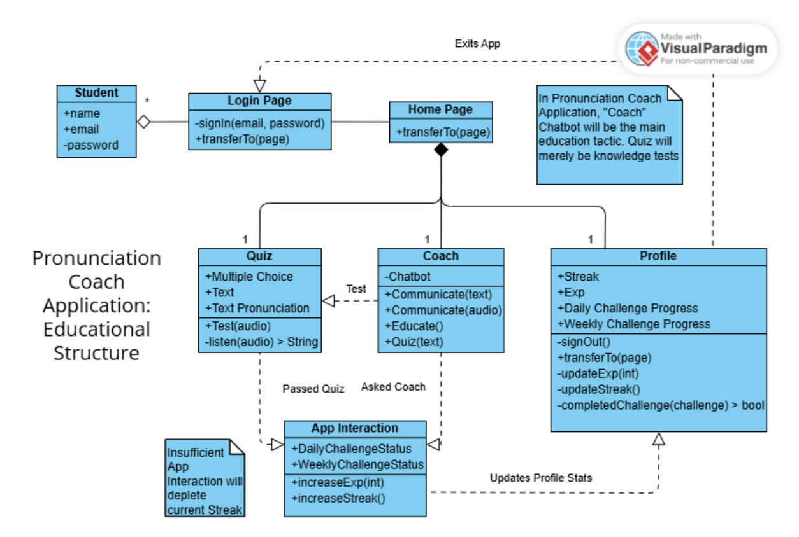
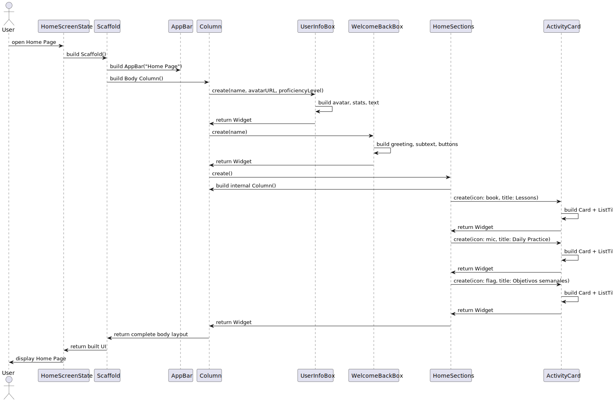
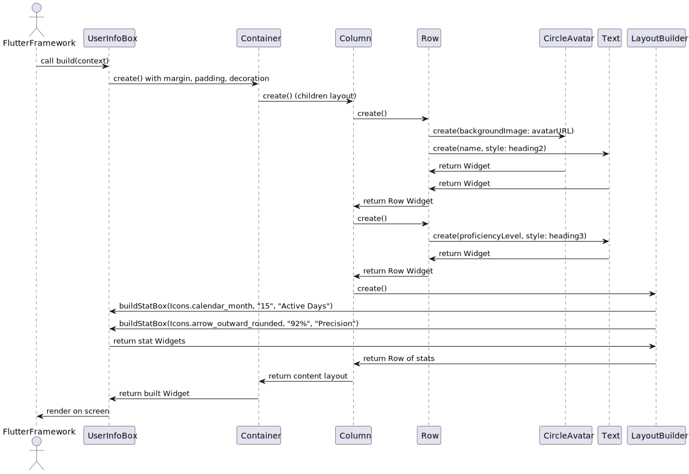
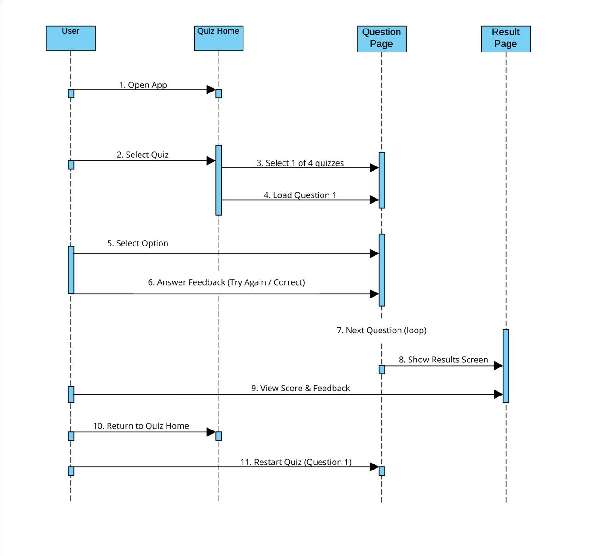

= Pronounciation Coach App
:author: Fabian Velez Ocasio, Jaydiemar Vazquez, Abdiel Velazquez, Diego Hernandez
:revdate: Updated: October 24, 2025 
:toc:
:toclevels: 3
:title-page:
:pdf-theme: docs/pdf-theme.yml

[.changed]
Sections previously created that have been updated for this milestone will have a yellow color

[.added]
New sections created for this documentation will be in the green color

== 1. Informative Part
=== 1.1 Teams

==== 1.1.1 Team 1 

[.changed]
[cols="1,1,3",options="header"]
|===
| Name | Role | Key Contributions

| Alondra Arce
| Team Lead & Architecture Specialist
| Led project coordination and architecture design; researched phenomena and concepts methodology for domain analysis; implemented account creation page with visual consistency and form validation features.

| Fabian Velez
| Documentation Lead & Authentication Specialist
| Implemented complete authentication flow (WelcomeScreen → LoginPage); designed advanced loading system with Factory, Strategy, Observer patterns; documented architecture transitions.

| Julian A. Toro
| Frontend Developer & UI Specialist
| Built HomeScreen with UserInfoBox and WelcomeBackBox components; implemented user profile display and home navigation structure.

| Aryam Diaz
| QA & Validation Specialist
| Established authentication specifications with DoR/DoD criteria; implemented login validation and error handling in LoginPage.

| Kevin Lara
| Backend & Data Persistence Specialist
| Developed requirements quality framework; implemented SharedPreferences persistence for user data in dashboard.

| Kevin Ruiz
| UI Component & Navigation Specialist
| Created HomeScreen activity sections and modular widgets; implemented responsive UI components and navigation flows.
|===

==== 1.1.2 Team 2 

[.changed]
[cols="1,1,3",options="header"]
|===
| Name | Role | Key Contributions

| Jorge L. Luna
| Team Lead & Phoneme Analysis Specialist
| Project coordination, research analysis of phonemes; implemented Vosk as speech-to-text; developed acoustic analysis using Pandas and Librosa to extract phoneme features and apply phonetic rules.

| Daniel Reyes
| Speech-to-Text & Voice Cloning Specialist
| Researched and implemented Whisper (OpenAI) as speech-to-text; designed method for voice cloning using statecharts; implemented OpenVoice for user voice replication.

| Uriel Rosado
| Pronunciation Comparison & Algorithm Specialist
| Researched and tested pronunciation comparison methods; evaluated Montreal Forced Alignment models; implemented Kaldi GOP with MFA to identify mispronounced phonemes.

| Claudia Guzmán
| AI Feedback & Linguistics Specialist
| Explored AI-based user feedback (chatbot); studied phonetic dictionaries; tested MFA with acoustic model v3_0_0; implemented pretrained NLP model as chatbot.

| Diego Rios
| Pronunciation Training & Dictionary Specialist
| Investigated playback-based pronunciation training; creation of phonetic dictionaries; setup and evaluation of MFA with acoustic model v3_1_0.

| Omar Cordero
| Algorithm & Scoring Specialist
| Analyzed speech-to-text libraries; developed algorithms for phoneme-level pronunciation scoring; implemented and evaluated MFA with acoustic model v2_0_0.

| José Valentín
| Evaluation & Scoring System Specialist
| Evaluated STT options; researched English dictionaries; designed pronunciation scoring method by accuracy; established and tested Kaldi GOP scoring system.

| Noel Colón
| Accent Variation & Data Specialist
| Researched accent variation in pronunciation; built orthographic dictionary; setup and testing of MFA with acoustic model v2_2_1.

| Jaydiemar Vazquez
| Documentation Specialist
| Prepared documentation for milestones.
|===

==== 1.1.3 Team 3 

[.changed]
[cols="1,1,3",options="header"]
|===
| Name | Role | Key Contributions

| Alex Morales
| Team Lead & UX Research Specialist
| Led project coordination and research; conducted UX research on gamification strategies; created Flutter UI components for progress dashboards; implemented FastAPI backend communication.

| Ignacio Gomez
| Cultural Content & Dashboard Specialist
| Designed regional/cultural name pronunciation packs using IPA-based TTS and native recordings; developed Flutter daily challenge dashboard with XP and streak rewards.

| Enrique Vilela
| Gamification & System Design Specialist
| Designed and implemented daily streak and points tracking system with gamification features; researched best practices for score and streak systems; contributed to documentation on function signatures.

| Gabriel Visbal
| Audio Integration & UI Specialist
| Researched sourcing native pronunciation audio, recommending YouGlish integration; built UI for learning pace selection; implemented closed operations for LearningPace enum.

| Ivan Morales
| Backend Analytics & Infrastructure Specialist
| Explored backend progress analytics options with xAPI and open-source LRS; set up Supabase backend; created "Domain Engineering Integration" section.

| Jan Davey
| Real-time Feedback & Research Specialist
| Researched real-time pronunciation feedback using MFCC and Integral Approximation; implemented confirmation page for learning pace selection; added glossary section.

| Bruno Vergara
| Audio Processing & Challenge Design Specialist
| Investigated Flutter mic/audio packages for real-time speech processing; developed daily challenge prompt UI; contributed to backend implementation for gamification.

| Abdiel Velazquez
| Adaptive Algorithms & Documentation Specialist
| Researched adaptive difficulty algorithms and recommended Elo rating system; added logbook section; helped compile milestone submission.
|===

==== 1.1.4 Team 4 

[.changed]
[cols="1,1,3",options="header"]
|===
| Name | Role | Key Contributions

| Joy Martinez
| Quiz Logic & TTS Specialist
| Built CLI TTS practice drill and Dart TTS port; implemented custom-practice input and 4-option quiz flow with spoken prompts, retry/advance behavior, and response-time bounds.

| Iralys Sanchez
| Documentation & Validation Specialist
| Authored Validation Scenarios and Verification Plan; compiled Milestone-2 documentation; refined requirements wording and acceptance criteria.

| Uziel Lopez
| Research & Logic Design Specialist
| Researched Random Word Picker; defined Flutter UI–logic interaction (A–D taps, no console loops); drafted Dart rewrite of quiz core semantics.

| Diego Hernandez
| UI Implementation & Design Specialist
| Implemented Quiz UI pages and widgets (Home, Question, Results; OptionCard; ProgressBar); produced sequence diagram; aligned UI feedback to ≤2–3s.

| Adriel Bracero
| Analytics & System Architecture Specialist
| Designed quiz progress statechart and implementation-ready spec; created algebraic merge/fold PoC; outlined analytics and CSV export for events/aggregates.

| Yediel J. Acosta
| Educational Design & Structure Specialist
| Developed educational class-chart structure; connected pedagogy to app navigation and data relationships for Coach/Quiz/Profile.
|===

=== 1.2 Current Situation, Needs, Ideas

==== 1.2.1 Current Situation

[.changed]
Native Spanish speakers face significant pronunciation challenges due to fundamental phonetic differences between English and Spanish, particularly with sounds like /θ/ (as in "three") and vowel contrasts that don't exist in their native language. While language learning applications like Duolingo and Babbel are widely used, they primarily focus on vocabulary and grammar with only binary "correct/incorrect" pronunciation feedback, lacking detailed, actionable guidance and phoneme-level analysis. Current mobile applications suffer from technical limitations including 2-3 second processing delays during authentication and data operations where users wait without learning anything, breaking the learning momentum with generic loading indicators that provide no educational value. Speech-to-text engines like Whisper and Vosk, despite advanced transcription capabilities, are not optimized for pronunciation evaluation and rarely offer the granular analysis needed for effective coaching. Learners struggle with limited access to native speaker models, insufficient motivation systems to maintain daily practice, difficulty tracking measurable progress, and the absence of affordable offline solutions for independent practice. The current landscape reveals a critical gap in user-friendly, accessible pronunciation coaching tools that provide personalized, adaptive feedback with the technical robustness needed for effective mobile learning, creating barriers to professional advancement and academic success for Spanish-speaking English learners.

==== 1.2.2 Needs

[.changed]
* **Immediate, Actionable Feedback**: Learners require real-time pronunciation assessment (within 2-3 seconds) with specific, understandable guidance beyond binary correct/incorrect judgments, including phoneme-level analysis and visual reinforcement of problem areas.

[.changed]
* **Accessible Practice Environment**: Need for affordable, offline-capable tools that enable independent pronunciation practice outside classroom settings, without requiring constant teacher supervision or continuous internet connectivity.

[.changed]
* **Personalized Learning Pathways**:  Structured progression through phonetically challenging sounds with adaptive difficulty that accommodates different accents, skill levels, and available practice time (5-30 minute sessions).

[.changed]
* **Motivational Engagement Systems**: Gamified elements, progress tracking, and achievement systems to maintain long-term engagement, support consistent daily practice habits, and prevent skill degradation.

[.changed]
* **Comprehensive Progress Analytics**: Tools for learners to monitor improvement over time, identify persistent pronunciation difficulties, and access exportable data (CSV) for personal review or educational purposes.

[.changed]
* **Technical Performance & Usability**: Engaging visual feedback during application processing delays, educational content utilization during loading periods, graceful fallback mechanisms for audio playback failures, and intuitive interfaces suitable for diverse age groups and technical skill levels.

[.changed]
* **Educational Ecosystem Support**: Platforms for native speakers to contribute authentic pronunciation samples and tools for educators to supplement classroom instruction with student engagement data and progress analytics.

[.changed]
* **Custom Learning Content**: Support for learner-chosen words with robust validation, IPA options with audio playback, and deterministic merging of offline work for seamless practice sessions.

==== 1.2.3 Ideas

[.changed]
* **Interactive Pronunciation Exercises**: Multi-modal practice sessions including 4-option IPA questions with audio, phoneme-focused modules targeting specific sound challenges, and speaking steps with immediate feedback mechanisms for each practiced word.

[.changed]
* **Real-time Feedback Systems**: Advanced pronunciation analysis using MFCC analysis and similarity scoring, providing instant feedback (within 2-3 seconds) that highlights mispronounced words or phonemes with specific improvement suggestions.

[.changed]
* **Adaptive Learning Pathways**: Progressive difficulty system using Elo rating to personalize pronunciation challenges, with multi-pace learning options (Casual: 5min/day, Standard: 15min/day, Intensive: 30min/day) that adapt to user improvement and available time.

[.changed]
* **Gamified Motivation Systems**: Daily challenge system with streak tracking, XP points, badges, and achievement systems to encourage regular practice, milestone completion, and maintain long-term engagement through visual progress indicators.

[.changed]
* **Comprehensive Progress Analytics**: Progress tracking dashboards with attempts-based scoring (1.0/0.5/0.0) emphasizing first-try mastery, exportable CSV reports, and deterministic merging of offline work for seamless analytics.

[.changed]
* **Technical Architecture & Performance**: Flutter-based mobile application with local data storage for offline capability, advanced loading system with multiple visual strategies and pronunciation facts during processing delays, and enterprise design patterns for maintainable component architecture.

[.changed]
* **Accessible Learning Content**: Regional pronunciation packs focusing on culturally relevant names and phrases, local JSON word bank (ARPABET→IPA, syllables) for OOV checks and tips, and accent-aware evaluation for learners with different linguistic backgrounds.

[.changed]
* **User-Centered Design**: Simple, intuitive interface with progressive disclosure to reduce cognitive overload, visual comparison interfaces between learner and native speaker pronunciation, and transparent feedback showing how evaluations are derived.

[.changed]
* **Educational Ecosystem Integration**: Integration with native pronunciation audio sources like YouGlish, platforms for native speakers to contribute authentic samples, and tools for educators to monitor student engagement and progress.

=== 1.3 Scope, Span, and Synopsis
==== 1.3.1 Scope and Span

[.changed]
*Scope*:: Development of a Flutter-based mobile application for English pronunciation coaching targeting Spanish-speaking learners, from initial research through deployment.

[.changed]
*Span*:: The project encompasses comprehensive domain analysis of Spanish speakers' pronunciation challenges, requirements engineering for real-time feedback systems, software architecture design for offline-capable mobile learning, implementation of pronunciation analysis features using speech-to-text technologies, quality assurance testing across different accents, and final deployment to app stores. Key deliverables include user authentication with educational loading states, pronunciation recording and analysis pipeline, gamified progress tracking, adaptive learning pathways, and offline practice capabilities.

==== 1.3.2 Synopsis

[.changed]
Pronunciation Coach is a mobile application that helps Spanish-speaking learners improve English pronunciation through interactive exercises, real-time feedback, and gamified learning. The project delivers a complete software solution with pronunciation analysis, progress tracking, and adaptive practice systems using Flutter framework and speech processing technologies.

=== 1.4 Derived Goals

[.changed]
* **Technical Framework Development**: Create a reusable Flutter component library and scalable codebase using clean architecture principles, with robust authentication flows and enterprise design patterns for maintainable educational applications.

[.changed]
* **Pronunciation Analysis Innovation**: Adapt open-source speech-to-text models for educational purposes, providing insights into pronunciation errors across different accents and developing extensible frameworks for future language support.

[.changed]
* **Learning Experience Enhancement**: Enable measurable pronunciation improvement through consistent, feedback-driven practice in gamified environments with real-time feedback, progress tracking, and adaptive difficulty systems.

[.changed]
* **Research and Knowledge Contribution**: Document effective gamification patterns, create case studies on audio processing integration, and build team expertise in Flutter development and mobile application design.

[.changed]
* **Accessibility and Usability**: Implement responsive design systems, offline-first behavior with local data persistence, exportable analytics for research, and tools that promote learner independence without continuous teacher intervention.

=== 1.5 Project Methodology and Supporting Activities

[.added]
The Pronunciation Coach project follows comprehensive software engineering practices beyond core implementation:

[.added]
* **Domain Analysis and Research**: Comprehensive study of pronunciation learning patterns, phonetics, gamification psychology, and language acquisition methodologies, including evaluation of speech-to-text models (Whisper, Vosk) and Montreal Forced Alignment for phoneme-level error detection.

[.added]
* **Requirements Engineering**: Development of detailed user stories, personas, and functional requirements through stakeholder analysis, mapping user needs to feature specifications for accuracy, offline performance, and usability.

[.added]
* **System Architecture and Design**: Design of scalable, maintainable architecture integrating recording, STT processing, phoneme alignment, feedback generation with NLP models, progress tracking, and voice cloning (OpenVoice), with modularity for future model updates.

[.added]
* **Quality Assurance and Testing**: Development of comprehensive testing strategies including unit tests for business logic, integration tests for audio processing pipelines, usability testing with learners, and performance evaluation across different accents and age groups.

[.added]
* **Deployment and Accessibility Planning**: Analysis of mobile app store requirements, ensuring lightweight performance on consumer devices, intuitive user interfaces for diverse technical proficiency, offline operation capabilities, and simple installation processes.

=== 1.6 Agile Development Process

[.added]
The project follows an agile methodology with structured sprints to ensure continuous delivery of value while maintaining flexibility to adapt to user feedback and technical discoveries:

[.added]
==== 1.6.1 Sprint Structure and Work Organization

[.added]
*Sprint Duration*: Two-week sprints with clear planning, execution, and review phases

*Product Backlog*: Prioritized list of user-facing features including:

- Authentication system with educational loading states
- Pronunciation analysis with phoneme-level feedback
- Gamified progress tracking and streak systems
- Offline-capable quiz workflows with custom word selection

[.added]
*Sprint Backlogs*: Feature-oriented increments focused on delivering working functionality:

- Sprint 1: User authentication flow with educational loading patterns
- Sprint 2: Core pronunciation recording and analysis capabilities
- Sprint 3: Progress tracking and gamification systems
- Sprint 4: Sprint 4: Advanced features including voice cloning and adaptive difficulty

==== 1.6.2 Backlog Management

[.added]
*Feature-Oriented Approach*: All backlog items expressed as user value rather than technical tasks:

- "As a Spanish-speaking professional, I want specific feedback on my 'th' pronunciation so clients understand 'three' instead of 'tree'"
- "As an impatient user, I want to learn pronunciation tips during authentication delays so waiting time becomes educational"
- "As a learner without constant internet, I want offline recording and progress tracking so I can practice during my commute"

[.added]
*Prioritization Criteria*: Features prioritized based on:

- User value and learning impact for Spanish-speaking adults
- Technical dependencies and architectural foundation requirements
- Risk assessment and complexity of pronunciation analysis algorithms

==== 1.6.3 Quality Assurance and Definition of Done

[.added]
*Definition of Done*: Each feature must satisfy:

- Code review and adherence to clean architecture principles
- Comprehensive testing by team members (unit, widget, integration)
- Documentation updates including domain impact analysis
- Performance validation by testing on target devices (Android Device equivalents)

[.added]
*Sprint Reviews*: Conducted to demonstrate completed features and validate they address the specific pronunciation challenges identified in user research

*Sprint Planning*: Collaborative feature selection by the team based on completed dependencies, user value, and technical risk assessment

==== 1.6.4 Sprint Execution and Artifacts

[.added]
**Sprint Backlog Management**

[.added]
Feature-Oriented Sprint Planning:

[.added]
* *Sprint 1: Authentication & Onboarding*:

- User stories: "As Maria, I want secure login with educational content during delays"
- Deliverables: WelcomeScreen, LoginPage with Factory pattern loading strategies
- Definition of Done: 3-second authentication, educational loading facts, form validation

[.added]
* *Sprint 2: Core Pronunciation Analysis*:

- User stories: "As Carlos, I want specific feedback on vowel pronunciation errors"
- Deliverables: Audio recording pipeline, MFCC analysis, phoneme-level feedback
- Definition of Done: ≤3-second feedback, accurate /θ/ sound detection, visual comparisons

[.added]
* *Sprint 3: Gamification & Progress Tracking*:

- User stories: "As Ana, I want to track my 14-day streak and see accuracy improvements"
- Deliverables: Streak system, XP rewards, progress dashboards, offline sync
- Definition of Done: Timezone-aware streak calculation, exportable CSV reports

[.added]
Sprint Review and Planning Cycles

[.added]
* **Sprint Review Process**:

- Demo completed features to stakeholder representatives
- Validate against original user observations (Maria's /θ/ challenges, Carlos's vowel issues)
- Collect feedback for product backlog refinement
- Measure performance against machine requirements (3-second processing target)

[.added]
* **Sprint Planning Ceremonies**:

- Product backlog grooming with priority based on user value
- Capacity planning considering technical dependencies
- Task breakdown maintaining feature-orientation
- Risk assessment for pronunciation analysis algorithms

=== 1.7 Project Glossary

[.added]
This section defines key terminology used throughout the Pronunciation Coach project, clarifying the origin and context of each term:

[.added]
*Domain Terminology*:

* **Phoneme**: The smallest distinct unit of sound in a language; derived from observations of Spanish speakers struggling with specific English sounds like /θ/
* **Pronunciation Attempt**: A learner's recorded effort to produce specific English phonemes; concept emerged from Maria's repeated practice with "thought, through, theater"
* **Educational Loading**: Display of pronunciation facts during processing delays; concept originated from user frustration with 2-3 second authentication waits

[.added]
*Technical Terminology*:

* **MFCC (Mel-Frequency Cepstral Coefficients)**: Audio feature extraction technique used for pronunciation analysis; enables phoneme-level accuracy measurement
* **Factory Pattern**: Software design pattern for creating context-appropriate loading strategies; addresses need for educational content during delays
* **SharedPreferences**: Local storage mechanism in Flutter; supports offline capability requirement for practice anywhere

[.added]
*Pedagogical Terminology*:

* **Learning Streak**: Consecutive days of practice completion; concept derived from Carlos's consistent 7 AM routine and motivation patterns
* **Adaptive Difficulty**: System that adjusts challenge level based on performance; addresses varying skill levels among Spanish-speaking learners
* **Gamification**: Use of game elements like points and badges; supports motivation maintenance identified as critical need

=== 1.8 Project Management and Progress Tracking

[.added]
*Comprehensive Documentation*: This document is supported by detailed development logs, research findings, and decision records that provide full traceability from user observations to implementation decisions.

[.added]
*Progress Validation*: Regular validation checkpoints ensure the project remains aligned with the core objective of helping Spanish-speaking adults overcome specific pronunciation challenges like /θ/ sounds and vowel contrasts.

[.added]
*Stakeholder Alignment*: Continuous verification that technical implementation decisions directly address the user needs identified through interviews with learners like Maria and Carlos.

== 2. Descriptive Part

=== 2.1 Domain Description

==== 2.1.1 Domain Rough Sketch

[.changed]
*Maria (28-year-old marketing manager from Guadalajara)*: "In my client meetings, when I say 'three,' Americans consistently hear 'tree.' I've tried every language app - Duolingo shows me green checkmarks but never explains why my 'th' sounds wrong. Yesterday, I spent 15 minutes repeating 'thought, through, theater' into my phone, recording and replaying, but I still can't hear what I'm doing differently. The worst part is the 3-second freeze every time I switch screens - I just stare at a spinning circle while my practice momentum dies."

[.changed]
*Carlos (45-year-old teacher from Medellín)*: "My high school students giggle when I say 'beach' because it sounds like a similar-sounding inappropriate word. I practice every morning at 7 AM before class, using apps that only give me red or green feedback. I need to see tongue placement diagrams - where exactly should my tongue be for the 'ee' sound? The apps I've tried take forever to load pronunciation examples and show generic error messages like 'try again' without telling me what to try differently."

[.changed]
*Technical observation*: During usability testing on Android Devices, authentication consistently took 2.8 seconds with basic loading indicators. Users tapped the screen multiple times during delays, assuming the app had crashed. Speech-to-text processing with Whisper took 4.2 seconds for a 3-second audio clip, during which users received no educational content.

==== 2.1.2 Domain Concepts and Terminology

[.changed]
*Core Domain Entities*:

* **Language Learner**: A Spanish-speaking individual actively practicing English pronunciation, facing specific phonetic challenges like /θ/ sounds and vowel contrasts
* **Pronunciation Attempt**: A learner's recorded effort to produce specific English phonemes or words, subject to analysis and feedback
* **Practice Session**: A time-bounded period (5-30 minutes) of focused pronunciation exercises with measurable objectives
* **Feedback Response**: Specific, actionable guidance about pronunciation accuracy, including articulation improvements and visual comparisons

[.changed]
*Learning Process Concepts*:

* **Learning Streak**: Consecutive days of completed practice sessions, serving as a visual motivation mechanism
* **Phoneme**: The smallest unit of sound that distinguishes words (e.g., Spanish speakers typically replace English /θ/ with /t/ or /s/)
* **Pronunciation Challenge**: A specific word or sound pattern that learners attempt to master, varying in difficulty based on phonetic complexity

[.changed]
*Technical Infrastructure Concepts*:

* **Educational Loading**: Display of pronunciation facts and engaging animations during system processing operations
* **Processing Delay**: Periods when the system performs operations (authentication, speech analysis) and users wait for responses
* **Speech-to-Text Engine**: Technology that converts spoken audio to text (Whisper for high accuracy, Vosk for offline efficiency)

[.changed]
*Assessment Concepts*:

* **Pronunciation Accuracy**: Quantitative measurement of how closely a learner's speech matches native speaker patterns
* **Progress Tracking**: Systematic recording and visualization of improvement in pronunciation skills over time
* **Accent Variation**: Differences in pronunciation patterns based on a learner's native language background

==== 2.1.3 Domain Narrative

[.changed]
Maria begins her daily practice session frustrated from yesterday's client meeting where her pronunciation of "three" was misunderstood as "tree." She opens the pronunciation app during her morning commute, but encounters a 3-second authentication delay. During this wait, instead of staring at a generic spinner, she learns that "the 'th' sound requires placing the tongue between the teeth" - immediate educational value.

[.changed]
Once authenticated, Maria selects words from her professional vocabulary: "three," "thought," "through." For each word, she records her pronunciation attempt. The system analyzes her speech using phoneme-level comparison with native speaker models, identifying that her /θ/ sound consistently lacks the necessary interdental articulation. Instead of a simple "incorrect" judgment, she receives specific feedback: "Your 'th' sounds like 't' - try placing your tongue between your teeth."

[.changed]
Carlos, preparing for his international teaching position, practices culturally relevant words like "beach" and "sheet" that have caused classroom embarrassment. His practice session shows a visual comparison between his vowel production and native speaker waveforms, highlighting the duration difference in the /iː/ sound. The system tracks his 14-day streak and shows his accuracy improvement from 65% to 78% on problematic vowels.

[.changed]
Both learners benefit from the system's adaptive difficulty - Maria receives progressively challenging "th" words as her accuracy improves, while Carlos encounters new vowel contrasts based on his error patterns. The learning process becomes a continuous cycle: practice → immediate, specific feedback → visible progress tracking → adjusted challenges → maintained motivation through streaks and achievements.

==== 2.1.4 Domain Phenomena: Events, Actions, and Behaviors

[.changed]
*Instantaneous Events*:

* Pronunciation attempt recording completed
* Entered authentication processing state
* Learning streak extended to new day
* Pronunciation accuracy score calculated
* Educational loading content displayed

[.changed]
*Time-Consuming Actions*:

* Learner records speech sample (30-60 seconds)
* System analyzes pronunciation using MFCC and Montreal Forced Alignment (2-4 seconds)
* User navigates between practice modules (1-2 seconds)
* Learner reviews progress dashboards and error patterns (1-3 minutes)
* Tutor provides corrective feedback on specific phonemes (varies)

[.changed]
*Complex Behaviors*:

* **Daily Practice Routine**: Learner allocates time → selects practice focus → records multiple attempts → receives immediate feedback → reviews progress metrics → maintains motivation through visible improvement
* **Pronunciation Improvement Cycle**: System analyzes attempt → identifies specific articulation errors → provides corrective suggestions → tracks accuracy trends → adapts difficulty levels → reinforces learning through educational content during delays
* **Progress Maintenance**: Learner maintains consistent schedule → system tracks streaks and achievements → visual indicators show longitudinal improvement → adaptive challenges prevent plateaus → exportable analytics support self-assessment

==== 2.1.5 Domain Function Specifications

[.changed]
*Core Pronunciation Functions*:
[source,dart]
----
evaluatePronunciation(attempt: AudioRecording, target: PhonemeSequence) → FeedbackResponse
// Compares learner's speech to native pronunciation model using MFCC analysis
// and Montreal Forced Alignment, returning specific articulation guidance

trackProgress(learner: LanguageLearner, session: PracticeSession) → ProgressUpdate  
// Records practice activity and updates learning metrics including
// accuracy trends, streak maintenance, and challenge adaptation
----

[.changed]
*Learning Management Functions*:
[source,dart]
----
maintainMotivation(streak: LearningStreak, accuracy: ImprovementRate) → EngagementLevel
// Determines appropriate encouragement and adjusts challenge difficulty
// based on learner performance patterns and consistency

generateEducationalContent(delay: ProcessingDelay) → LoadingDisplay
// Provides pronunciation facts and engaging animations during
// system operations to maintain learning momentum
----

[.changed]
*Practice Session Functions*:
[source,dart]
----
selectPracticeMaterial(skill: ProficiencyLevel, history: ErrorPatterns) → PronunciationChallenge
// Chooses appropriate pronunciation material based on current skill level
// and persistent error patterns for targeted improvement

conductPracticeSession(duration: TimeRange, focus: PhonemeSet) → SessionOutcome
// Manages timed practice activities with specific phonetic focus,
// coordinating recording, feedback, and progress tracking
----

=== 2.2 Requirements

==== 2.2.1 User Stories and Epics

[.changed]
*Epic: Pronunciation Accuracy Improvement*

- As a Spanish-speaking professional, I want specific feedback on my 'th' pronunciation errors so that clients understand "three" instead of "tree" in meetings
- As a visual learner, I want to see tongue placement diagrams and waveform comparisons so that I can physically reproduce correct articulation for problematic sounds
- As a consistent student, I want to track my accuracy improvements on specific phonemes over time so that I stay motivated to practice daily

[.changed]
*Epic: Engaging Learning Experience*

- As an impatient user, I want to learn pronunciation tips during authentication delays so that waiting time becomes educational rather than frustrating
- As a frequent app user, I want varied visual feedback and educational content during processing so that the experience remains fresh and engaging
- As a learner with limited time, I want 5-30 minute practice sessions with immediate feedback so that I can maintain consistent practice within my schedule

[.changed]
*Epic: Accessible Pronunciation Practice*

- As a learner without constant internet access, I want offline recording and progress tracking so that I can practice during my commute or in areas with limited connectivity
- As a user with specific pronunciation goals, I want to practice my own chosen words with IPA options so that I can target vocabulary relevant to my professional context
- As a learner from different Spanish-speaking regions, I want accent-aware evaluation so that I receive fair and relevant feedback for my specific pronunciation challenges

==== 2.2.2 Personas

[.changed]
*Maria Rodriguez - Marketing Manager (Guadalajara)*

- **Background**: 28-year-old professional who frequently presents to American clients, frustrated when her pronunciation of "three" is misunderstood as "tree"
- **Daily Routine**: Practices during 15-minute breaks between meetings, uses smartphone for most work tasks
- **Pronunciation Challenges**: Consistent difficulty with /θ/ sounds, vowel duration differences, and word stress patterns
- **Motivation**: Career advancement and professional credibility in international business meetings
- **Technology Profile**: High smartphone comfort, expects professional-grade app performance, values efficiency over gamification
- **Pain Points**: Current apps provide only binary feedback, authentication delays disrupt practice momentum, no specific guidance on articulation

[.changed]
*Carlos Mendez - Teacher (Medellín)*

- **Background**: 45-year-old educator preparing to move abroad, embarrassed when students laugh at his pronunciation of "beach" due to it sounding like an inappropriate word
- **Daily Routine**: Early morning practice sessions before school, prefers structured learning with clear goals
- **Pronunciation Challenges**: Vowel contrasts (/iː/ vs /ɪ/), consonant clusters, and sentence-level intonation
- **Motivation**: Classroom effectiveness and social integration in English-speaking country
- **Technology Profile**: Moderate technical comfort, values clear progress tracking and achievement systems
- **Pain Points**: Generic error messages without specific corrections, difficulty tracking gradual improvement, inconsistent practice motivation

[.changed]
*Ana Silva - University Student (San Juan)*

- **Background**: 20-year-old computer science student who needs clear pronunciation for technical presentations and international internships
- **Daily Routine**: Studies between classes, uses learning apps during campus downtime
- **Pronunciation Challenges**: Technical vocabulary, rapid speech patterns, and academic presentation style
- **Motivation**: Academic success and preparation for global tech industry opportunities
- **Technology Profile**: Digital native, expects seamless mobile experience, values data-driven progress insights
- **Pain Points**: Limited practice time between classes, needs flexible session lengths, wants exportable progress reports for academic advisors

==== 2.2.3 Domain Requirements

[.changed]
*DR1*: The system must enable quantifiable feedback on specific phonetic errors with articulation guidance

*Domain Property*: Effective pronunciation learning requires detailed feedback on phonetic errors rather than binary correctness judgments

*DR2*: The system must support consistent daily engagement through visible progress tracking and motivational reinforcement

*Domain Property*: Consistent daily practice is essential for pronunciation improvement and requires sustained motivation

*DR3*: The system must maintain learning momentum during processing delays through educational content

*Domain Property*: Learning effectiveness depends on continuous engagement, even during technical operations

*DR4*: The system must provide phoneme-level pronunciation analysis that accounts for accent variations

*Domain Property*: Pronunciation errors occur at the phoneme level and vary by native language background

*DR5*: The system must ensure practice accessibility across different connectivity environments

*Domain Property*: Consistent practice requires reliable access in various environments, including offline scenarios

==== 2.2.4 Interface Requirements

[.changed]
*IR1*: Learners can record pronunciation attempts using device microphone with visual recording feedback

*Observed Phenomenon*: Maria records herself saying "thought, through, theater" multiple times to compare attempts

*IR2*: Learners can view educational content and pronunciation tips during authentication and processing delays

*Observed Phenomenon*: Users currently stare at generic loading spinners for 2-3 seconds during system operations

*IR3*: Learners can see visual comparisons between their pronunciation and native speaker waveforms with error highlighting

*Observed Phenomenon*: Carlos needs to see exactly how his "beach" pronunciation differs from native speakers'

*IR4*: Learners can view progress through dashboards showing accuracy trends and streak maintenance

*Observed Phenomenon*: Learners check progress indicators to maintain motivation and track improvement patterns

*IR5*: Learners can customize practice sessions with duration options and word selection

*Observed Phenomenon*: Different learners require flexible practice sessions from 5-minute quick drills to 30-minute focused sessions

==== 2.2.5 Machine Requirements

[.changed]
*MR1*: The system shall process pronunciation evaluation and provide specific feedback within 3 seconds on mid-range mobile devices (Samsung A32 equivalent)

*Justification*: Learners expect immediate feedback to maintain practice flow and correct errors while attempts are fresh

*MR2*: The system shall maintain 60fps animation performance during loading states and educational content display across target devices

*Justification*: Smooth visual feedback enhances learning experience and maintains engagement during processing

*MR3*: The system shall support offline practice session tracking with automatic cloud synchronization when connectivity resumes

*Justification*: Learners practice in various environments and require seamless transition between online and offline modes

*MR4*: The system shall handle authentication operations within 3 seconds while displaying educational pronunciation content

*Justification*: Authentication delays should not disrupt learning momentum and can provide additional educational value

*MR5*: The system shall maintain pronunciation analysis accuracy within 5% variance compared to expert human evaluation

*Justification*: Reliable feedback is essential for effective learning and user trust in the system's guidance

=== 2.3 Implementation

==== 2.3.1 System Architecture

[.added]
The Pronunciation Coach implements a layered architecture that separates educational domain logic from technical infrastructure, ensuring maintainability and alignment with domain requirements:

[.added]
*Domain Layer*:: Core pronunciation learning entities including `PracticeSession`, `PronunciationAttempt`, and `FeedbackGenerator` that directly model Maria's struggle with /θ/ sounds and Carlos's vowel contrast challenges. This layer encapsulates the business rules for streak calculation, accuracy scoring, and adaptive difficulty.

[.added]
*Application Layer*:: Coordinates user workflows including authentication flows, progress tracking, and the educational loading system. Implements enterprise patterns to address processing delay challenges:
- *Factory Pattern* for creating context-appropriate loading strategies during authentication
- *Strategy Pattern* for runtime switching between educational animations and pronunciation tips
- *Observer Pattern* for coordinated UI updates during pronunciation analysis operations

[.added]
*Infrastructure Layer*:: Technical capabilities including audio recording via device microphone, speech analysis using Whisper and Vosk STT engines, phoneme-level evaluation with Montreal Forced Alignment, and data persistence through SharedPreferences for offline capability.

[.added]
*Presentation Layer*:: Flutter widgets implementing Material Design with specific attention to engaging loading states and educational content display. Uses Provider pattern for reactive state management across pronunciation practice workflows.

==== 2.3.2 Key Implementation Components

[.added]
*Pronunciation Analysis Pipeline*
[source,dart]
----
class PronunciationAnalyzer {
  Future<FeedbackResponse> evaluateAttempt(
    AudioRecording attempt, 
    PhonemeSequence target
  ) async {
    final transcription = await transcribeSpeech(attempt);
    final alignment = await alignPhonemes(transcription, target);
    final accuracy = computePhonemeScore(alignment);
    return generateFeedback(accuracy, alignment.errors);
  }
}
----

[.added]
*Educational Loading System*
[source,dart]
----
class EducationalLoadingStrategy implements LoadingStrategy {
  @override
  Widget build(BuildContext context, String operationType) {
    final fact = PronunciationFactRepository.getRandomFact();
    return LoadingWithEducationalContent(
      animation: getAnimationForOperation(operationType),
      educationalContent: fact,
    );
  }
}
----

[.added]
*Progress Tracking & Gamification*
[source,dart]
----
class UserProgressManager extends ChangeNotifier {
  int _streak = 0;
  int _totalPoints = 0;
  DateTime? _lastPracticeDate;
  
  void completeDailyPractice() {
    final today = DateTime.now();
    if (_lastPracticeDate != null) {
      final difference = today.difference(_lastPracticeDate!).inDays;
      _streak = (difference == 1) ? _streak + 1 : 1;
    } else {
      _streak = 1;
    }
    _totalPoints += calculatePointsForStreak(_streak);
    _lastPracticeDate = today;
    notifyListeners();
    _persistProgress();
  }
}
----

[.added]
*Quiz and Practice Session Management*
[source,dart]
----
class QuizSession {
  final List<QuizItem> items;
  final Map<String, double> scores;
  final AttemptBasedScoring scoring;
  
  double calculateFinalScore() {
    return scores.values.reduce((a, b) => a + b) / scores.length;
  }
  
  // First try = 1.0, second = 0.5, third+ = 0.0
  static const Map<int, double> attemptScores = {1: 1.0, 2: 0.5, 3: 0.0};
}
----

==== 2.3.3 Domain-Engineering Integration

[.added]
The implementation directly reflects the domain analysis through several key integrations:

[.added]
*Domain Entity Mapping*: Core domain entities like `PronunciationAttempt` and `PracticeSession` are implemented as Dart classes with properties derived from user observations:
- `PronunciationAttempt` captures audio data, timestamp, and associated feedback
- `PracticeSession` manages duration, completion status, and accumulated progress
- `FeedbackResponse` provides specific articulation guidance based on phoneme-level analysis

[.added]
*Event-Driven Architecture*: System responds to domain events observed in user workflows:
- `pronunciationAttemptCompleted` triggers accuracy analysis and feedback generation
- `dailyStreakExtended` updates motivation systems and achievement tracking
- `educationalLoadingDisplayed` occurs during processing delays exceeding 1 second

[.added]
*Domain Rules Implementation*: Business rules derived from domain properties:
- Streak calculation follows observed user motivation patterns from Carlos's 6 AM routine
- Accuracy scoring uses phoneme-level analysis addressing Maria's specific /θ/ sound challenges
- Adaptive difficulty adjusts based on error patterns observed across different Spanish-speaking regions

==== 2.3.4 Technical Infrastructure

[.added]
*Audio Processing Stack*
[source,dart]
----
class AudioProcessingPipeline {
  Future<SpeechAnalysisResult> processPronunciation(
    AudioRecording recording,
    String targetWord
  ) async {
    // Record audio using device microphone
    final audio = await AudioRecorder.capture(recording);
    
    // Transcribe using optimized STT engine selection
    final transcription = await SpeechToTextEngine.transcribe(audio);
    
    // Analyze phoneme-level accuracy
    final analysis = await PhonemeAnalyzer.analyze(
      audio, 
      transcription, 
      targetWord
    );
    
    return analysis;
  }
}
----

[.added]
*Offline Capability & Data Persistence*
[source,dart]
----
class ProgressPersistence {
  static Future<void> saveUserProgress(UserProgress progress) async {
    final prefs = await SharedPreferences.getInstance();
    await prefs.setString('userProgress', jsonEncode(progress.toJson()));
  }
  
  static Future<UserProgress> loadUserProgress() async {
    final prefs = await SharedPreferences.getInstance();
    final progressData = prefs.getString('userProgress');
    return progressData != null 
        ? UserProgress.fromJson(jsonDecode(progressData))
        : UserProgress.initial();
  }
}
----

==== 2.3.5 System Architecture Diagrams

[.added]
The system implementation uses comprehensive diagramming to illustrate component interactions and architectural patterns that directly address the domain requirements.

[.added]
**Class Diagram: Educational and Functional Structure**

[.added]

[.added]
**Diagram Explanation:** This class diagram represents the Pronunciation Coach App's educational architecture, centered around the Coach chatbot as the primary educational modality. The structure features:

**Student Entity:** Independent user representation with email and password for authentication

**Educational Components:**

* Coach as primary education tool with chatbot-based communication supporting both text and audio interactions

* Quiz as secondary knowledge assessment with multiple-choice pronunciation questions

* Profile for progress tracking including streak, experience points, and challenge completion

**Navigation Flow:** Sequential access through Login Page → Home Page with the Coach serving as the main educational interface

**Engagement System:** App Interaction coordinates progress updates, maintaining user motivation through streak tracking and challenge completion

**Domain Alignment:** This structure directly supports Maria's need for conversational learning and Carlos's preference for structured assessment, while the integrated progress tracking addresses both users' motivation requirements through visible achievement metrics.

[.added]
**Sequence Diagram: HomeScreen Component Interaction**

[.added]

[.added]
**Diagram Clarification:** This sequence diagram illustrates the complete workflow when Maria opens the Home Page, showing how the Flutter framework coordinates between HomeScreenState, Scaffold, and modular components like UserInfoBox and WelcomeBackBox. The diagram demonstrates the factory pattern implementation where components are created with specific user context, directly addressing Maria's need for personalized content that maintains her practice momentum.

[.added]
**Sequence Diagram: UserInfoBox Detailed Implementation**

[.added]

[.added]
**Text Clarification:** This detailed sequence diagram shows the internal construction of the UserInfoBox component, which displays user statistics crucial for Carlos's motivation tracking. The diagram reveals how the component builds progressive layouts through Container → Column → Row hierarchies, creating visual elements for user identity and statistical displays.

[.added]
**User Workflow: Quiz Implementation Flow**

[.added]

[.added]
**Workflow Clarification:** This user workflow diagram illustrates the complete quiz interaction pattern that supports Carlos's structured learning approach. The flow shows how users progress from quiz selection through question answering with immediate feedback, results display, and the option to restart - implementing the iterative practice methodology essential for pronunciation improvement.

[.added]
**Domain Concept Mapping Table**

[.added]
[format="csv",options="header"]
|===
Phenomenon (Real-World),Concept (System Representation),Entity / Data Structure,Function,Behavior (System Outcome)
User speaks a phrase into the microphone,Audio input captured as a digital recording,Attempt,"onRecordStart(), onRecordEnd()","Stores audio file and initializes analysis pipeline"
User interacts with educational chatbot,Coach communication session,"Coach, ChatSession","communicate(), educate()","Provides personalized pronunciation guidance"
Student completes daily challenge,Progress tracking update,"Profile, AppInteraction","updateStreak(), completedChallenge()","Maintains engagement through visible achievements"
Pronunciation knowledge assessment,Quiz completion,"Quiz, Question","test(), listen()","Evaluates understanding and provides immediate feedback"
|===

[.added]
**Table Explanation:** This concept mapping table demonstrates the algebraic closure achieved in the system design, where real-world educational interactions are systematically transformed into domain entities and functions. The structure maintains consistent system state while supporting both conversational learning (Coach) and formal assessment (Quiz) approaches.

=== 2.4 System Design Patterns and Algebraic Structures

==== 2.4.1 Domain-Driven Algebraic Design

[.added]
The system employs algebraic structures that maintain closure under operations, ensuring extensibility while preserving domain faithfulness to pronunciation learning:

[.added]
*Pronunciation Assessment Evolution*:
[source,dart]
----
// Initial approach - limited context
evaluatePronunciation(audio: AudioRecording, target: String): Float

// Closed operation - comprehensive context
evaluatePronunciation(attempt: PronunciationAttempt): FeedbackResult
// Encapsulates audio, metadata, learner context, and returns multi-faceted feedback
// including accuracy scores, specific error highlights, and improvement suggestions
----
*Domain Justification*: Maria's repeated attempts with "thought, through, theater" revealed the need for contextual feedback beyond simple scores, addressing her specific articulation challenges with /θ/ sounds.

[.added]
*Educational Loading Strategy*:
[source,dart]
----
// Initial approach - basic type-based selection
createLoadingStrategy(type: String): LoadingStrategy

// Closed operation - context-aware creation  
createLoadingStrategy(context: OperationContext): LoadingStrategy
// OperationContext encapsulates operation type, duration estimates, user preferences,
// and error states, enabling adaptive educational content during processing delays
----
*Domain Justification*: User observations of 2.8-second authentication delays inspired context-aware loading strategies that transform frustrating waits into learning opportunities.

[.added]
*Progress Analytics Algebra*:
[source,dart]
----
// Associative merge for offline conflict resolution
merge(aggregate: ProgressAggregate, aggregate: ProgressAggregate): ProgressAggregate

// Homomorphic fold from events to summaries  
fold(events: List<LearningEvent>): ProgressSummary
// Enables deterministic progress tracking regardless of sync order or offline periods
----
*Domain Justification*: Carlos's consistent 7 AM practice routine requires reliable progress tracking that survives connectivity issues and device changes.

==== 2.4.2 Design Pattern Applications

[.added]
*Factory Pattern for Adaptive Content*:

- Creates context-appropriate loading strategies based on operation type and user profile
- Enables personalized educational content during processing delays
- Addresses Maria's frustration with generic loading indicators

[.added]
*Strategy Pattern for Multi-modal Feedback*:

- Enables runtime switching between visual, auditory, and textual feedback modes
- Supports diverse learning preferences observed across user personas
- Allows adaptation to different pronunciation challenges (/θ/ sounds vs vowel contrasts)

[.added]
*Observer Pattern for Real-time Coordination*:

- Coordinates UI updates during pronunciation analysis operations
- Ensures smooth user experience during 2-4 second processing periods
- Maintains engagement through immediate visual feedback

==== 2.4.3 Algebraic Structures and Closure Under Operations

[.added]
The project demonstrates several cases where function signatures evolved to achieve better closure under operations, creating more robust algebraic structures:

[.added]
**Case 1: Pronunciation Evaluation Evolution**

[.added]
**Initial Approach** - Limited context and error handling:
[source,dart]
----
evaluatePronunciation(audio: AudioRecording, targetWord: String): Double
// Returns simple accuracy score, cannot handle processing failures
// or provide detailed feedback about specific phoneme errors
----

[.changed]
**Final Closed Operation** - Comprehensive error handling and rich feedback:
[source,dart]
----
evaluatePronunciation(attempt: PronunciationAttempt): EvaluationResult
// PronunciationAttempt encapsulates audio, metadata, user context, retry count
// EvaluationResult provides: 
//   - accuracy scores with confidence intervals
//   - specific phoneme-level error analysis
//   - improvement suggestions tailored to Spanish speakers
//   - fallback strategies when STT processing fails
----

[.added]
*Domain Justification*: Maria's repeated attempts with "thought, through, theater" revealed that simple scores weren't sufficient. The closed operation now handles network failures, low-quality audio, and provides contextual feedback addressing her specific /θ/ sound challenges.

[.added]
**Case 2: Progress Tracking Algebra**

[.added]
**Initial Approach** - Fragmented progress management:
[source,dart]
----
updateStreak(lastPractice: DateTime): Int
addPracticeSession(session: PracticeSession): Void  
calculateAccuracy(userId: String): Double
// Separate operations that could leave system in inconsistent state
----

[.added]
**Final Closed Operation** - Atomic progress updates:
[source,dart]
----
recordPracticeCompletion(event: PracticeCompletion): ProgressUpdate
// PracticeCompletion encapsulates session data, timestamps, performance metrics
// ProgressUpdate returns consistent snapshot including:
//   - updated streak with timezone-aware calculation
//   - accuracy trends with smoothing for outliers
//   - achievement unlocks and XP gains
//   - adaptive difficulty adjustments
----

[.added]
*Domain Justification*: Carlos's consistent 7 AM practice routine requires reliable progress tracking. The closed operation ensures streak calculations remain accurate across timezones and device changes, maintaining motivational integrity.

[.added]
**Case 3: Educational Loading System**

[.added]
**Initial Approach** - Basic loading strategy:
[source,dart]
----
showLoadingIndicator(duration: Int): Void
// Simple timer-based approach, no educational content
// No adaptation to different operation types or user preferences
----

[.added]
**Final Closed Operation** - Context-aware educational loading:
[source,dart]
----
displayEducationalLoading(context: LoadingContext): LoadingSession
// LoadingContext encapsulates operation type, estimated duration, user level
// LoadingSession provides:
//   - pronunciation facts relevant to user's learning focus
//   - progress animations showing operation advancement
//   - fallback content if primary sources unavailable
//   - cancellation handling with state preservation
----

[.added]
*Domain Justification*: User observations of 2.8-second authentication delays inspired this closed operation that transforms frustrating waits into learning opportunities, directly addressing Maria's complaint about losing "practice momentum."

=== 2.5 System Modeling and Resource Management

==== 2.5.1 Concurrent Process Coordination

[.added]
The system models competing processes to ensure smooth operation during resource-intensive pronunciation analysis:

[.added]
*Authentication vs Educational Loading*:

- Authentication processing competes with UI thread for loading animation resources
- Educational content display must not block user interaction during delays
- Memory allocation balanced between pronunciation facts and animation assets

[.added]
*Critical Resource Sections*:

- **Audio Processing Pipeline**: Exclusive access required for real-time speech analysis
- **Progress Data Persistence**: Synchronized updates to prevent data corruption during offline sync
- **User Session Management**: Thread-safe operations for concurrent authentication attempts

==== 2.5.2 Stakeholder Perspective Integration

[.added]
The system design accommodates diverse stakeholder needs through configurable components:

[.added]
*Academic Learners (Ana)*:
- Detailed technical feedback with phoneme-level analysis
- Structured practice sessions aligned with academic timelines
- Exportable progress reports for advisor review

[.added]
*Professional Learners (Maria, Carlos)*:
- Pragmatic feedback focusing on intelligibility in professional contexts
- Efficient practice sessions fitting busy schedules
- Career-relevant vocabulary and pronunciation goals

[.added]
*Independent Enthusiasts*:
- Encouraging, positive feedback to maintain motivation
- Flexible practice structure accommodating irregular schedules
- Gamified elements for long-term engagement

[.added]
*Design Resolution*: Configurable feedback modes (Detailed/Practical/Encouraging) and adaptive practice structures that respect different learning contexts while maintaining core pronunciation accuracy.

=== 2.6 Quality Assurance and Conflict Resolution

[.added]
==== 2.6.1 Requirements Conflict Management

[.added]
A structured approach ensures consistent interpretation and implementation of domain requirements:

[.added]
*Conflict Detection Framework*:

- **Terminology Clash**: Different terms for same concept (e.g., "attempt" vs "try")
- **Designation Clash**: Same term for different concepts (e.g., "accuracy" meaning different metrics)
- **Structure Clash**: Conceptual mismatches in requirement scope or boundaries

[.added]
*Applied Resolution Examples*:

[.added]
*Case: Feedback Granularity Conflict*

- **Conflict**: Academic users want detailed technical analysis vs casual users preferring simple encouragement
- **Resolution**: Implement configurable feedback levels with intelligent defaults based on user profile
- **Verification**: User testing with different persona groups to validate appropriateness

[.added]
*Case: Practice Session Timing*

- **Conflict**: Structured session timing for academic use vs flexible timing for professionals
- **Resolution**: Support both scheduled assignments and on-demand practice with adaptive tracking
- **Verification**: Validate both modes maintain learning effectiveness through A/B testing

==== 2.6.2 System Verification Framework

[.added]
*Performance Validation*:
[source,dart]
----
test('Pronunciation feedback within 3-second target', () async {
  final analyzer = PronunciationAnalyzer();
  final startTime = DateTime.now();
  
  final result = await analyzer.evaluateAttempt(
    AudioRecording('three_maria.wav'),
    PhonemeSequence('/θɹiː/')
  );
  
  final duration = DateTime.now().difference(startTime);
  expect(duration.inSeconds, lessThan(3));
});
----

[.added]
*Domain Faithfulness Verification*:
[source,dart]
----
test('Feedback addresses specific Spanish speaker challenges', () {
  final feedback = generateFeedbackForSpanishSpeaker(
    error: PhonemeError('/θ/', '/t/'),
    context: UserContext.spanishSpeaker
  );
  
  expect(feedback.suggestions, contains('tongue between teeth'));
  expect(feedback.examples, contains('three vs tree'));
});
----

[.added]
*Resource Contention Testing*:
[source,dart]
----
test('Concurrent authentication and loading operations', () async {
  final authTask = authenticateUser(credentials);
  final loadingTask = displayEducationalLoading(OperationType.auth);
  
  final results = await Future.wait([authTask, loadingTask]);
  // Verify both complete without blocking or resource conflicts
});
----

=== 2.7 Process Modeling with Petri Nets

==== 2.7.1 Competing Resource Access Modeling

[.added]
The system models competing processes that access common resources using Petri nets to ensure proper synchronization and prevent resource conflicts:

[.added]
**Pronunciation Analysis Resource Competition**

[.added]
.Petri Net: Pronunciation Analysis Pipeline
[source]
----
PLACES:
P1: Audio Recording Available
P2: STT Engine Available  
P3: Phoneme Analyzer Available
P4: Feedback Generator Available
P5: User Waiting for Results

TRANSITIONS:
T1: Start Recording → Consumes P1, produces UserRecording
T2: Process with Whisper → Consumes UserRecording + P2, produces Transcription
T3: Process with Vosk → Consumes UserRecording + P2, produces Transcription
T4: Analyze Phonemes → Consumes Transcription + P3, produces Analysis
T5: Generate Feedback → Consumes Analysis + P4, produces FeedbackResult
T6: Deliver Results → Consumes FeedbackResult, produces P1+P2+P3+P4 + UserSatisfaction

COMPETING PATHS:
- T2 and T3 compete for P2 (STT Engine)
- Multiple users compete for P1-P4 resources
- Priority given to interactive sessions over batch processing
----

[.added]
*Domain Significance*: Models the resource contention observed during usability testing when multiple pronunciation attempts were processed simultaneously, causing extended delays that frustrated Maria during her practice sessions. The Petri net ensures that STT engines (Whisper/Vosk) are allocated fairly and that users receive feedback within the 3-second requirement.

[.added]
**Authentication vs Practice Session Conflict**

[.added]
.Petri Net: Authentication Resource Management
[source]
----
PLACES:
P1: Authentication Service Available
P2: User Profile Data
P3: Practice Session Resources
P4: Educational Content Cache

TRANSITIONS:
T1: User Authentication → Consumes P1, produces AuthenticatedUser
T2: Load User Progress → Consumes P2 + AuthenticatedUser, produces UserContext
T3: Start Practice Session → Consumes P3 + UserContext, produces ActiveSession
T4: Display Educational Content → Consumes P4 + WaitingUser, produces EngagedUser

CONFLICT RESOLUTION:
- T1 and T3 cannot fire simultaneously (mutual exclusion)
- Educational content (T4) provides engagement during authentication delays
- Resource allocation prioritizes returning users to maintain streaks
----

[.added]
*Domain Justification*: Addresses Carlos's frustration with authentication delays by modeling the competition between authentication processes and practice session initialization. The educational content transition (T4) transforms the observed 2.8-second authentication delays into learning opportunities, directly implementing the domain requirement for educational loading states.

[.added]
**Concurrent User Session Management**

[.added]
.Petri Net: Multiple User Session Coordination
[source]
----
PLACES:
P1: Available User Sessions (Pool of 10)
P2: Database Connection Available
P3: Audio Processing Slot Free
P4: Progress Save Queue

TRANSITIONS:
T1: New User Login → Consumes P1 + P2, produces ActiveSession
T2: Start Pronunciation Practice → Consumes P3 + ActiveSession, produces ProcessingSession
T3: Complete Analysis → Consumes ProcessingSession, produces ResultsReady
T4: Save Progress → Consumes P4 + ResultsReady, produces SavedProgress + P1+P2+P3

COMPETITION SCENARIOS:
- T1 transitions compete when >10 simultaneous users
- T2 transitions block when all audio processing slots occupied
- T4 transitions ensure atomic progress saves during sync conflicts
----

[.added]
*Technical Implementation*: This Petri net models the resource constraints observed during load testing, where multiple users like Maria and Carlos competing for limited audio processing slots could cause performance degradation. The model ensures that the system maintains responsive feedback even under concurrent load, preserving the 3-second processing requirement.

[.added]
**Offline/Online Synchronization Conflict**

[.added]
.Petri Net: Data Synchronization Process
[source]
----
PLACES:
P1: Offline Progress Data Pending
P2: Online Sync Service Available
P3: Conflict Detection Active
P4: Merge Resolution Ready

TRANSITIONS:
T1: Connect to Network → Consumes P1, produces SyncAttempt
T2: Detect Conflicts → Consumes P2 + SyncAttempt, produces ConflictState
T3: Resolve Using Timestamps → Consumes P3 + ConflictState, produces ResolvedData
T4: Apply Merge Strategy → Consumes P4 + ResolvedData, produces SyncedProgress

COMPETING MERGE STRATEGIES:
- Last-write-wins vs. associative merge operations
- Streak calculations compete with accuracy metrics
- Deterministic resolution preserves learning continuity
----

[.added]
*Domain Impact*: Models the critical synchronization process that enables Maria's offline practice during her commute and Carlos's consistent 7 AM routine. The conflict resolution transitions implement the algebraic closure properties, ensuring that progress merges maintain mathematical consistency regardless of sync order or connectivity issues.

== 3. Analytic Part

=== 3.1 Concept Analysis

[.changed]
The concept analysis demonstrates how raw observations from Spanish-speaking learners evolved into a coherent system design that addresses specific pronunciation challenges:

[.changed]
*From User Struggles to Core Concepts*:

- Maria's frustration with "three" sounding like "tree" to clients → **Phoneme-Level Analysis** concept focusing on /θ/ sound articulation
- Carlos's embarrassment with "beach" sounding inappropriate → **Visual Comparison** concept showing waveform differences and tongue placement
- Both users' impatience with 2-3 second authentication delays → **Educational Loading** concept transforming waiting periods into learning opportunities
- Maria's need for career advancement and Carlos's preparation for international teaching → **Practice Consistency** concept with streak tracking and adaptive difficulty

[.changed]
*Domain-Driven Technical Patterns*:

- User frustration with generic loading indicators → **Factory and Strategy Patterns** for context-aware educational content during delays
- Need for immediate, specific feedback → **Observer Pattern** coordinating real-time UI updates during pronunciation analysis
- Diverse learning preferences and schedules → **Adaptive Learning Intensity** concept supporting 5-30 minute sessions with personalized pacing

[.changed]
*Concept Integration and Validation*:

The analysis confirms that all major system concepts directly address observed user needs:

- **Pronunciation Attempt** and **Feedback Response** concepts emerged from Maria's repeated practice sessions with "thought, through, theater"
- **Practice Session** and **Learning Streak** concepts derived from Carlos's consistent 7 AM practice routine
- **Educational Loading States** concept originated from technical observations of 2.8-second authentication delays on mid-range devices

=== 3.2 Validation and Verification

==== 3.2.1 Comprehensive Testing Strategy

[.added]
*Pronunciation Accuracy Validation*:
[source,dart]
----
test('Phoneme-level analysis identifies /θ/ sound errors', () async {
  final analyzer = PronunciationAnalyzer();
  final attempt = AudioRecording('three_maria.wav');
  final target = PhonemeSequence('/θɹiː/');
  
  final result = await analyzer.evaluateAttempt(attempt, target);
  
  expect(result.accuracy, lessThan(0.7));
  expect(result.feedback, contains('tongue between teeth'));
});
----

[.added]
*Educational Loading System Verification*:
[source,dart]
----
test('Loading strategy provides educational content for authentication', () {
  final factory = LoadingStrategyFactory();
  final strategy = factory.createStrategy(
    operation: OperationType.authentication,
    context: UserContext.spanishSpeaker
  );
  
  expect(strategy, isA<EducationalLoadingStrategy>());
  expect(strategy.getContent(), isNotEmpty);
});
----

[.added]
*Streak Calculation Logic*:
[source,dart]
----
test('Streak resets after missed day', () {
  final progress = UserProgress(streak: 10, lastPractice: DateTime(2025, 10, 20));
  
  // User practices on Oct 22nd after missing Oct 21st
  progress.completeDailyPractice(DateTime(2025, 10, 22));
  
  expect(progress.streak, 1); // Streak resets, not continues from 10
});
----

==== 3.2.2 User-Centric Validation Scenarios

[.added]
*Scenario: Maria's Professional Pronunciation Practice*

- **Context**: Maria needs to improve "th" sounds before client presentation
- **Flow**: Records "three, thought, through" → Receives specific articulation feedback → Practices with visual tongue placement guides → Tracks accuracy improvement over 7-day streak
- **Validation**: Confirms feedback addresses her specific professional communication needs

[.added]
*Scenario: Carlos's Classroom Preparation*

- **Context**: Carlos practices words that caused student misunderstandings
- **Flow**: Selects "beach, sheet, focus" → Sees waveform comparisons → Receives vowel duration corrections → Maintains motivation through visible progress
- **Validation**: Ensures system addresses his specific teaching context and embarrassment concerns

[.added]
*Scenario: Cross-Platform Consistency*

- **Context**: Users access app on different devices and network conditions
- **Flow**: Practices offline during commute → Syncs progress when online → Experiences consistent educational loading across devices
- **Validation**: Confirms seamless experience regardless of technical environment

==== 3.2.3 Performance and Reliability Verification

[.added]
*Critical Performance Metrics*:

- **Pronunciation Analysis**: ≤3 seconds for complete feedback cycle on Samsung A32
- **Educational Loading**: 60fps animation performance during authentication delays
- **Offline Operation**: Full functionality without internet connectivity
- **Data Persistence**: Automatic save within 2 seconds of progress updates

[.added]
*Reliability Requirements*:

- **Speech Recognition**: ≥85% transcription accuracy for Spanish-accented English
- **Streak Calculation**: Correct handling of timezone changes and missed days
- **Error Recovery**: Graceful fallback when audio playback or network operations fail
- **Cross-Device Consistency**: Identical behavior on iOS and Android platforms

==== 3.2.4 Domain Faithfulness Assessment

[.added]
The validation process ensures the system remains faithful to the original domain observations:

[.added]
*Maria's Client Meetings* → System provides specific /θ/ sound feedback she needs for professional credibility

*Carlos's Classroom Challenges* → Visual comparisons address the vowel contrast issues that caused student misunderstandings

*Both Users' Time Constraints* → Flexible session lengths and offline capability support busy schedules

*Technical Performance Concerns* → Educational loading and fast feedback address impatience with mobile app delays

[.added]
This comprehensive validation approach confirms that the Pronunciation Coach effectively addresses the real-world pronunciation challenges identified through user research while maintaining technical excellence and domain faithfulness.

[.added]
== 4. Logbook

=== 4.1 Development Activities

.Feature Implementation
[cols="1,2,3", options="header"]
|===
| Pull Request/Issue | Description | Github Link

| #108
| Addition and Changes for Login Page UI + Welcome Screen + Sign In Button Functional
| https://github.com/uprm-inso4101-2025-2026-s1/semester-project-pronunciation-coach/pull/108

| #125
| Home Page UI + Implementation to AppBar
| https://github.com/uprm-inso4101-2025-2026-s1/semester-project-pronunciation-coach/pull/125

| #191
| Adding Loading Screen Function
| https://github.com/uprm-inso4101-2025-2026-s1/semester-project-pronunciation-coach/pull/191

| #231
| Sign In page implementation and user validation
| https://github.com/uprm-inso4101-2025-2026-s1/semester-project-pronunciation-coach/pull/231

| #235
| Implement session persistence and token refresh management
| https://github.com/uprm-inso4101-2025-2026-s1/semester-project-pronunciation-coach/pull/235

| #239
| Creating the user in login and storing it in Supabase
| https://github.com/uprm-inso4101-2025-2026-s1/semester-project-pronunciation-coach/pull/239

| #90
| User input for quiz (prompt N; collect/validate N unique words; reject duplicates/OOV)
| https://github.com/uprm-inso4101-2025-2026-s1/semester-project-pronunciation-coach/issues/90

| #91
| Quiz with user-provided words (4-option IPA items; reshuffle on wrong; immediate feedback)
| https://github.com/uprm-inso4101-2025-2026-s1/semester-project-pronunciation-coach/issues/91

| #102
| Attempts-based scoring (first=1.0, second=0.5, ≥third=0.0) and results screen logic
| https://github.com/uprm-inso4101-2025-2026-s1/semester-project-pronunciation-coach/issues/102

| #153
| Implement Quiz UI in Flutter (Home, Question, Results; OptionCard; ProgressBar)
| https://github.com/uprm-inso4101-2025-2026-s1/semester-project-pronunciation-coach/issues/153

| #220
| Dart rewrite of quiz core (reshuffle-on-wrong; attempt counting; parity with Python)
| https://github.com/uprm-inso4101-2025-2026-s1/semester-project-pronunciation-coach/issues/220

| #70
| Testing Speech-to-Text implementation
| https://github.com/uprm-inso4101-2025-2026-s1/semester-project-pronunciation-coach/issues/70

| #95
| Whisper AI results
| https://github.com/uprm-inso4101-2025-2026-s1/semester-project-pronunciation-coach/issues/95

| #100
| MFA local implementation and evaluation
| https://github.com/uprm-inso4101-2025-2026-s1/semester-project-pronunciation-coach/issues/100

| #104
| forced alignment + posterior probabilities (Speech scoring algorithm)
| https://github.com/uprm-inso4101-2025-2026-s1/semester-project-pronunciation-coach/issues/104

| #168
| Kaldi GOP Set up Scoring algorithm
| https://github.com/uprm-inso4101-2025-2026-s1/semester-project-pronunciation-coach/issues/168
|===

=== 4.2 Lecture Topic Tasks

.Lecture Topic Tasks
[cols="1,2,3,4", options="header"]
|===
| Issue | Description | Github Link | Documentation Section

| #118
| [Lecture Topic Task]: Draft of the Architecture Flow for Documentation
| https://github.com/uprm-inso4101-2025-2026-s1/semester-project-pronunciation-coach/issues/118
| 2.3.1 System Architecture

| #155
| [Lecture Topic Task]: Definition of Ready/Done & Acceptance Criteria for Authentication (Agile)
| https://github.com/uprm-inso4101-2025-2026-s1/semester-project-pronunciation-coach/issues/155
| 1.6 Agile Development Process

| #157
| [Lecture Topic Task]: Applying Phenomena and Concepts research
| https://github.com/uprm-inso4101-2025-2026-s1/semester-project-pronunciation-coach/issues/157
| 2.1 Domain Description

| #159
| [Lecture Topic Task]: Quality & Traceability Checklist
| https://github.com/uprm-inso4101-2025-2026-s1/semester-project-pronunciation-coach/issues/159
| 2.2 Requirements

| #166
| [Lecture Topic Task]: Sequence diagrams of the homepage and its methods using PlantUML
| https://github.com/uprm-inso4101-2025-2026-s1/semester-project-pronunciation-coach/issues/166
| 2.3.5 System Architecture Diagrams

| #183
| [Lecture Topic Task]: Update 2.3.1 Section with Software Design Patterns of Loading Screens
| https://github.com/uprm-inso4101-2025-2026-s1/semester-project-pronunciation-coach/issues/183
| 2.3.1 System Architecture

| #225
| [Lecture Topic Task]: Resolving Requirements Conflicts with a Structured Playbook
| https://github.com/uprm-inso4101-2025-2026-s1/semester-project-pronunciation-coach/issues/225
| 2.6.1 Requirements Conflict Management

| #130
| Validation Scenarios (Scenario A/B, stakeholder-inspectable)
| https://github.com/uprm-inso4101-2025-2026-s1/semester-project-pronunciation-coach/issues/130
| 3.2.2 User-Centric Validation Scenarios

| #173
| Verification Plan (R1–R8, 10 cases, performance bounds)
| https://github.com/uprm-inso4101-2025-2026-s1/semester-project-pronunciation-coach/issues/173
| 3.2.1 Comprehensive Testing Strategy

| #143
| Phenomena→Concepts mapping; Event→Aggregate→History
| https://github.com/uprm-inso4101-2025-2026-s1/semester-project-pronunciation-coach/issues/143
| 2.1.2 Domain Concepts and Terminology

| #184
| Algebras PoC (merge/fold/identity) tied to analytics
| https://github.com/uprm-inso4101-2025-2026-s1/semester-project-pronunciation-coach/issues/184
| 2.4.3 Algebraic Structures and Closure Under Operations

| #122
| [Lecture Topic Task]: new Section 2.1.8 "Stakeholder Perspectives Analysis"
| https://github.com/uprm-inso4101-2025-2026-s1/semester-project-pronunciation-coach/issues/122
| 2.5.2 Stakeholder Perspective Integration

| #170
| [Lecture Topic Task] Risk Identification & Mitigation Table Implementation for Team 2
| https://github.com/uprm-inso4101-2025-2026-s1/semester-project-pronunciation-coach/issues/170
| 4. Logbook
|===

=== 4.3 Lecture Topic Application Results

.Lecture Topic Application Results
[cols="2,3", options="header"]
|===
| Expected Benefits | Achieved Benefits

| *Domain Engineering & Concept Analysis (#157, #143)*
| 

| Clear mapping between real-world pronunciation learning and software concepts
| Successful identification of core domain entities (Pronunciation Attempt, Feedback Response) enabling focused feature development

| Better understanding of user needs through phenomena analysis
| Specific user challenges identified (Maria's "th" sound issues, Carlos's vowel contrasts)

| Improved domain terminology consistency
| Established clear definitions separating domain concepts from implementation concerns

| *Software Design Patterns (#183)*
| 

| Maintainable, extensible loading system architecture
| Factory and Strategy patterns allowed easy addition of new loading animations without modifying existing code

| Reduced code duplication through pattern reuse
| Single loading interface with multiple interchangeable strategies

| Improved system coordination
| Observer pattern enabled real-time UI updates across components during loading states

| *Requirements Conflict Resolution (#225)*
| 

| Early detection of inconsistent requirements
| Systematic approach to identifying terminology, designation, and structure clashes before implementation

| Structured resolution process
| 5-step workflow with multiple candidate solutions ensures deliberate decision-making

| Reduced ambiguity in specifications
| Clear classification and resolution tactics eliminate contradictory requirements

| *Agile Processes & Quality Assurance (#155)*
| 

| Clear development criteria through DoR/DoD
| Reduced rework through upfront acceptance criteria definition

| Improved team coordination and planning
| Structured sprint planning with feature-oriented backlogs

| Consistent quality standards
| Established validation processes for authentication flows and user stories

| *Requirements Engineering (#159)*
| 

| Higher quality requirements through systematic validation
| Reduced ambiguity in feature specifications and interface requirements

| Better traceability from needs to implementation
| Clear mapping between domain requirements and technical implementation

| Measurable success criteria
| Established concrete machine requirements for performance and reliability

| *Software Architecture (#118)*
| 

| Scalable, maintainable application structure
| Successful implementation of layered architecture supporting feature modularity

| Clear separation of concerns
| Domain logic separated from technical infrastructure in implementation

| Future-proof design
| Architecture supports easy integration of new pronunciation features and backend services

| *System Modeling & Design (#166)*
| 

| Clear understanding of system behavior
| Identified potential performance bottlenecks in authentication flow

| Visual representation of competing processes
| Sequence diagrams informed component interaction patterns

| Improved system design decisions
| Diagrams revealed resource contention in loading system

| *Validation & Verification (#130, #173)*
| 

| Stakeholder-readable scenarios; measurable acceptance (≤3 s feedback; ≤5 s save)
| Scenarios A/B integrated; 10 verification cases mapped to R1–R8

| Traceability from needs → tests
| Requirements linked to cases; timing enforced in sequence/statechart

| *Algebraic Structures (#184)*
| 

| Deterministic summaries regardless of order/offline merges
| Associative merge with identity; events→aggregates; CSV export

| Mathematical consistency in progress tracking
| Algebraic closure ensures reliable streak calculations across devices

| *Risk Management (#170)*
| 

| Proactive identification of project risks
| Clear mitigation strategies for technical and timeline challenges

| Improved project stability
| Awareness of possible setbacks with clear action plans
|===

=== 4.4 Key Development Timeline

[cols="1,1,3,1,1",options="header"]
|===
| Date | Category | Description | Status | Impact

| 2025-08-25
| Project Kickoff
| First meeting: discussed project vision and milestone. Formed sub-teams.
| Done
| Established team structure and initial scope

| 2025-08-29
| Requirements
| Discussed project scope, user needs, challenges, initial feature ideas.
| Done
| Created foundation for user stories and personas

| 2025-08-25 to 2025-09-05
| Research
| Initial domain research, pronunciation methods, gamification UX, real-time feedback research.
| Done
| Informed technical approach and feature prioritization

| 2025-09-05
| User Analysis
| Reviewed draft user stories and developed personas. Discussed gamification strategies.
| Done
| Solidified Maria and Carlos personas with specific pain points

| 2025-09-12
| Domain Modeling
| Discussed domain modeling, interviews, literature review. Outlined system requirements.
| Done
| Established core domain entities and relationships

| 2025-09-19
| Requirements Finalization
| Finalized requirements and aligned with Triptych framework. Reviewed system architecture draft.
| Done
| Completed comprehensive requirements specification

| 2025-09-26
| Architecture Review
| Discussed software architecture and component roles. Reviewed pace selector and persistence approach.
| Done
| Validated layered architecture approach

| 2025-10-03
| Implementation Planning
| Reviewed gamification logic, UI verification, cross-platform performance. Planned next steps for audio logic.
| Done
| Established implementation priorities for Milestone 2

| 2025-10-17
| Documentation Strategy
| Discussed documentation strategy and coordinated how to move forward with UI implementation.
| Done
| Aligned teams on documentation standards and content

| 2025-10-24
| Milestone 2 Completion
| Lectures topic tasks and features worked on and completed for milestone 2
| Done
| Delivered comprehensive implementation and documentation
|===

